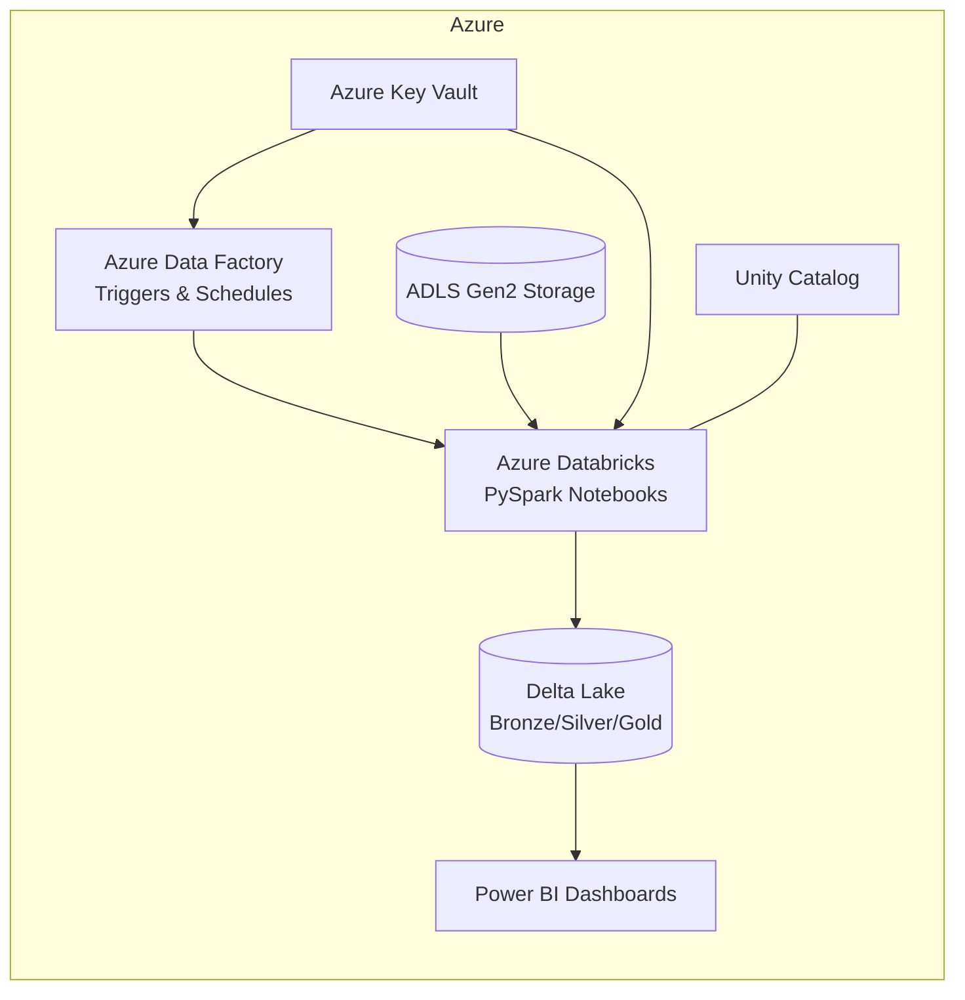
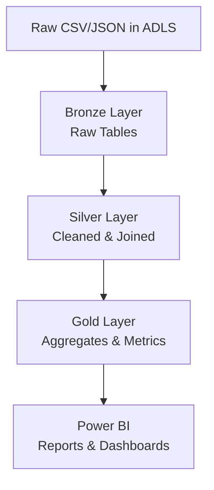

# Formula 1 Race Data Analysis

> End-to-end Azure lakehouse for ingesting, modeling, and analyzing Formula 1 race data.
> Built with **Azure Data Factory**, **Azure Databricks (PySpark + Delta Lake)**, **ADLS Gen2**, **Unity Catalog**, **Azure Key Vault**, and **Power BI**.

---

## 🚀 Project Overview

This project focuses on analyzing Formula 1 race data using Azure Cloud Services. The primary goals were to:

* **Optimize ETL pipelines** for efficient, scalable data processing.
* **Implement medallion architecture** (Bronze → Silver → Gold) with Delta Lake.
* **Ensure governance and security** using Unity Catalog and Key Vault.
* **Deliver insights** through interactive Power BI dashboards.

---

## 📂 Repository Structure

### 🔑 Set-Up

* `set-up/mount_adls_storage.py`: Mount ADLS Gen2 for seamless ingestion & processing.

### 🥉 Bronze (Raw Data)

* `raw/1.create_raw_tables.sql`: Create raw staging tables.
* Ingestion scripts (`ingestion/*.py`): Load circuits, races, constructors, drivers, results, pit stops, lap times, and qualifying data into ADLS.

### 🥈 Silver (Processed Data)

* `trans/*.py` & `trans/*.sql`: Apply cleaning, joins, and calculations.

  * `2.driver_standings.py`: Build driver standings.
  * `3.constructor_standings.py`: Build constructor standings.
  * `4.calculated_race_results.py`: Produce finalized race metrics.

### 🥇 Gold (Presentation)

* `trans/0.create_presentation_database.sql`: Create Gold-layer schema for BI.
* Analysis SQL (`analysis/*.sql`): Dominant drivers, teams, and visual queries.

### ⚙️ Utilities

* `utils/1.prepare_for_incremental_load.sql`: Incremental load prep.
* `includes/common_functions.py`: Reusable PySpark helpers.
* `includes/configuration.py`: Environment configs.

---

## 🏗️ Architecture

---

## 🪙 Medallion Data Flow

---

## 🔍 Key Analysis

* **Dominant Drivers:** Identified most consistent winners.
* **Dominant Teams:** Highlighted constructors with sustained performance.
* **Pit Stop Analysis:** Tracked efficiency and its impact on race results.
* **Lap Time Trends:** Revealed performance degradation patterns.

---

## 📊 Results

* **40% improvement** in ETL performance vs baseline.
* Real-time readiness: **1M+ telemetry points per race** processed.
* Incremental pipeline: Cut refresh cycles from 2h → 45m.
* Delivered Power BI dashboards for **20+ race weekends**.

---

## 🛠️ Technologies

* **Azure Data Factory:** Orchestration of ingestion pipelines.
* **Azure Databricks (PySpark):** Distributed transformations.
* **Delta Lake:** ACID-compliant data lake with medallion architecture.
* **Azure Data Lake Gen2:** Storage of raw & curated layers.
* **Power BI:** Dashboards for race metrics.
* **Azure Key Vault:** Secrets management.
* **Unity Catalog:** Governance and access control.

---

## 📌 Lessons Learned

* **Streaming pipelines need careful state mgmt** for telemetry data.
* **Delta Lake** ensures reliable incremental updates.
* **Power BI data models** must be optimized for low-latency dashboards.
* **Governance (Unity Catalog + Key Vault)** is non-negotiable for production pipelines.

---

## ▶️ How to Run

1. Mount ADLS with `set-up/mount_adls_storage.py`.
2. Run raw SQL to create Bronze tables.
3. Execute ingestion scripts (`ingestion/`).
4. Run Databricks notebooks for Silver + Gold transformations.
5. Execute analysis SQL for insights.
6. Connect Power BI to Gold tables for dashboards.

---

## 📈 Sample Dashboard

---

## 🔗 References

* GitHub Repo: [Formula 1 Race Data Analysis](https://github.com/dharun-karthick-ramaraj/formula1_race_data_analysis)
* Databricks Documentation: [Delta Lake](https://docs.delta.io)
* Power BI Docs: [Create Reports](https://learn.microsoft.com/en-us/power-bi/create-reports/)
